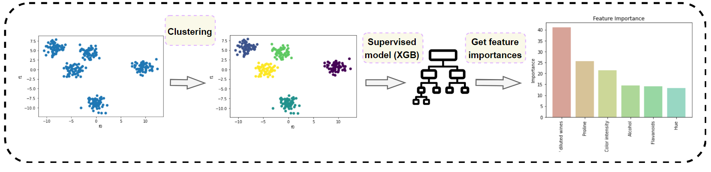
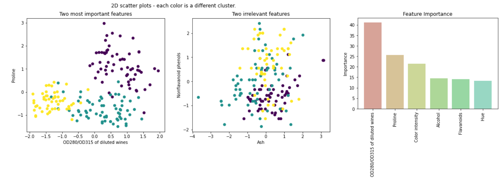

<!-- PROJECT -->
<br />
<p align="center">
  <h3 align="center">FEATURE IMPORTANCES FOR CLUSTERING WITH <code style="background: papayawhip;">clustfeatimp</code></h3>
</p>

`clustfeatimp` is a module for measuring feature importance for any clustering method.
<br/><br/>

<!-- TABLE OF CONTENTS -->
<details open="open">
  <summary>Table of Contents:</summary>
  <ol>
    <li><a href="#About">About</a></li>
    <li><a href="#Installation">Installation</a></li>
    <li><a href="#Example">Example</a></li>
  </ol>
</details>


## About

The aim of this project was to create a tool for measuring feature importance for any clustering method.<br>
<br>
The idea is simple. By providing the `ClusteringExplainer` object with data for the clustering model and its results, we can construct a multiclass classifier. The classifier learns the appropriate dependencies in the data, and a side effect of learning is a list of variables with their significance.<br>



<br>
More specific:<br>
The idea was to transform unsupervised learning methods to specific supervised methods which are easily interpreted (like tree-based methods). In this implementation I used the XGBoost model.<br>
As segmentation models often produce clusters that are unbalanced, the classifier uses the parameter, which control the balance of many classes weights. As a result, we do not have to worry that our clusters differ in the number of observations.<br>
Since the XGBoost model contains many hyperparameters that must be determined before starting the learning process, I used a simple Bayesian hyperparamert optimization with a small number of iterations (which you can define yourself). This allows you to quickly and efficiently find the best set of hyperparameters for a classifier.<br>
It is also possible to skip the hyperparameter optimization process. This speeds up the operation of the algorithm, however, it should be remembered that the default set of parameters does not always give good results.<br>
<strong>However, I recommend using Bayesian optimization</strong> <code style="background: papayawhip;">(fit_hiperparams = True)</code> <strong>even with a small number of iterations (5 by default).</strong>
<br>
<br>
The specific form of the XGBoost model allows to measure the significance of variables. This implementation uses the <strong>Gain</strong> measure.<br>
The <code>clustfeatimp</code> module also allows you to validate the quality of the created classifier using the <a href="https://scikit-learn.org/stable/modules/generated/sklearn.metrics.balanced_accuracy_score.html">balanced_accuracy_score</a> and <a href="https://scikit-learn.org/stable/modules/generated/sklearn.metrics.confusion_matrix.html">confusion_matrix</a>.<br>
<br>


How to get the feature importances for any clustering method?
1. Perform clustering with any method.
2. Use `ClusteringExplainer` to measure feature importances.
3. Get the results :smiley:

Below are plots showing two-dimensional relationships between the clusters for the two most important variables and two irrelevant variables.<br>
You can see a clear division into 3 segments with two most important variables in the left plot.<br>
It is not possible to make a clear clustering into 3 segments when using two irrelevant variables.<br>


## Installation
1. Use pip to install module from github
```sh
pip install -e git+https://github.com/msoczi/clustfeatimp#egg=clustfeatimp
```
2. Run python and import module:
```python
import clustfeatimp as cfi
```


## Example

```python
import clustfeatimp as cfi

from sklearn.datasets import make_blobs
from sklearn.cluster import KMeans
import matplotlib.pyplot as plt

# Create dataset
X, _ = make_blobs(n_samples=300, centers=5, n_features=2, random_state=7)

# Clustering with KMeans
kmeans = KMeans(n_clusters=5)
kmeans.fit(X)

# Assign cluster values to the variable y
y = kmeans.labels_

# Create ClusteringExplainer object and fit to the data
clust_explnr = cfi.ClusteringExplainer()
clust_explnr.fit(X, y)

# Feature importance for clustering variables
print('--- Feature Importance for KMeans clustering ---')
print(clust_explnr.feature_importance)

# Plot with feature importance
clust_explnr.plot_importances();plt.show()

# Plot 2D
plt.scatter(X[:,0], X[:,1], c=y)
plt.xlabel('f0');plt.ylabel('f1');plt.show()
```

[Here](https://github.com/msoczi/clustfeatimp/blob/main/exmpl/example.ipynb) is a notebook with example.

## Contact

Mateusz Soczewka - msoczewkas@gmail.com <br>
<br>
Thank you for any comments. :smiley:

